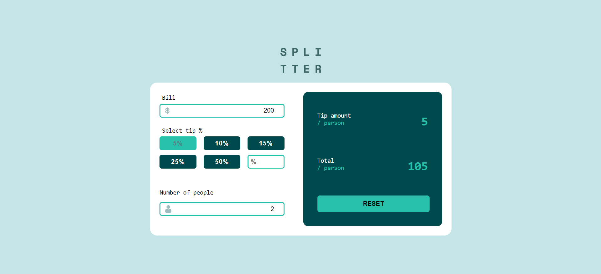
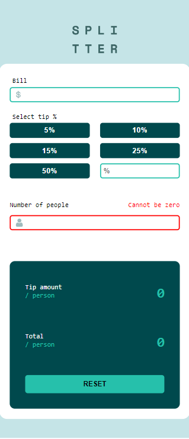

# Tip Calculator App

## Table of Contents

- [Overview](#overview)
  - [The challenge](#the-challenge)
  - [Screenshot](#screenshot)
- [My Process](#my-process)
  - [Built with](#built-with)
  - [What I Learned](#what-i-learned)

## Overview

### The Challenge

Users should be able to:

- View the optimal layout for the app depending on their device's screen size
- See hover states for all interactive elements on the page
- Calculate the correct tip and total cost of the bill per person

### Screenshot

## My Process

### Built With

- [React](https://reactjs.org/) - JavaScript library for building user interfaces
- [Styled Components](https://styled-components.com/) - Library for styling React components with CSS

### What I Learned

During the development of this tip calculator app:

- I improved my understanding of React and state management by implementing the necessary logic for handling user inputs and calculating tip amounts. The use of React's `useState` and `useEffect` hooks allowed for efficient state management and real-time updates.

- I explored and utilized Styled Components to style the components in a modular and maintainable way.

- Implementing a responsive design was achieved by using Styled Components along with media queries.

- I incorporated conditional rendering to display error messages when the number of people is zero, preventing calculations with invalid inputs.

- The app is built using functional components, and I refined my skills in handling events such as button clicks and input changes.

- I explored two options for resetting the app state—individually setting each state variable to zero and refreshing the page.
